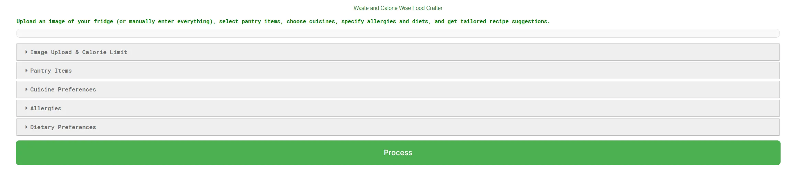
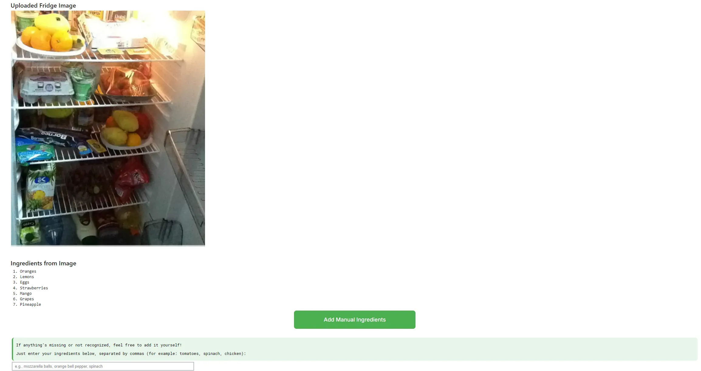
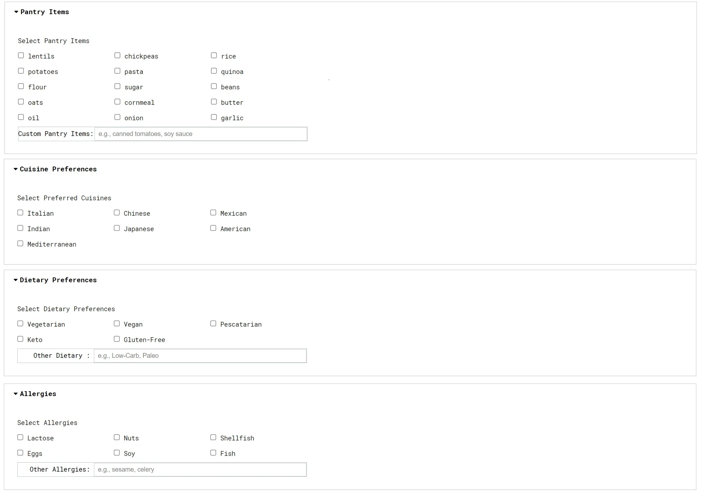
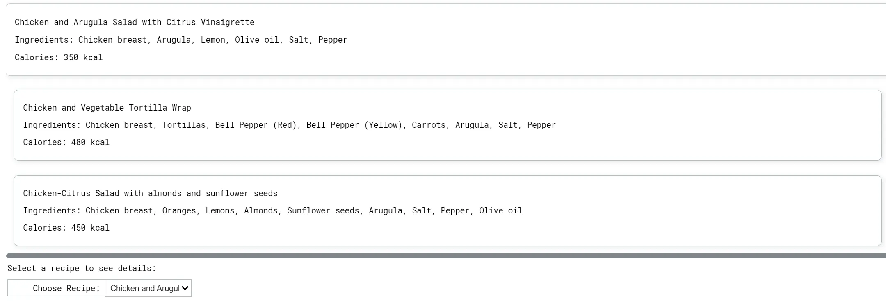
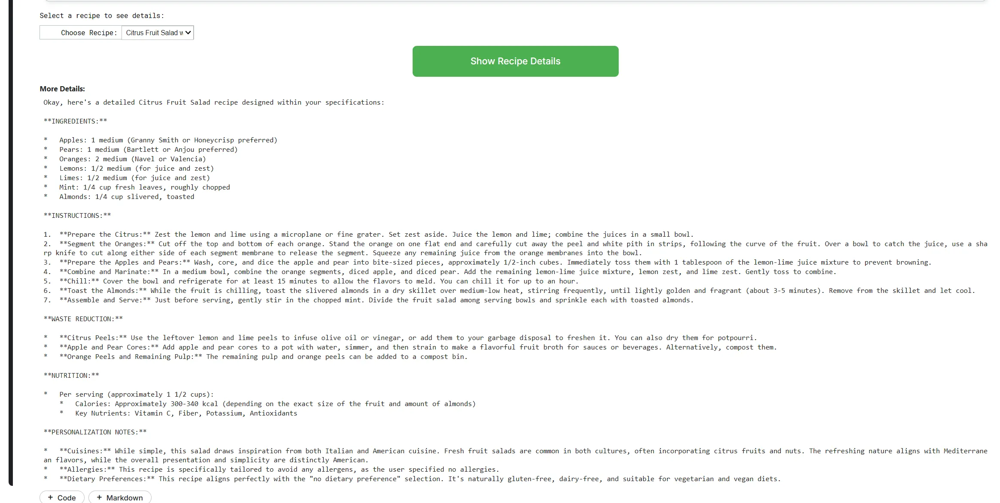

# BiteWise — Meal Planner 🍽️💡  
**From pantry chaos to plated perfection.**  
Smart, waste-aware meal planning that respects calories, diets, cuisines, and allergies.

[](https://youtube.com) 
[](https://www.kaggle.com/code/shimarastegar/bitewise)
[](https://medium.com/@brastgrants/blitudes-revolutionizing-meal-planning-with-your-sl-kitchen-assistant-fa7672bb6ce9)

<div align="center">
  
</div>

---

## 🚀 What it does
- 📸 **Smart Ingredient Detection:** Upload a photo (fridge, pantry, etc.), enter ingredients manually or use pantry library.  
- ⚖️ **Stay within calories:** Calorie-aware suggestions (e.g., 200-1200 kcal). 
- 🌱 **Dietary Customization:** Keto, Vegan, Gluten-Free, and 10+ other diets.
- 🌍 **Global Cuisines:** Italian, Japanese, Mexican, and more.
- ♻️ **Waste Reduction:** Prioritizes using what you already have.  
- 🛠️ **Developer-friendly.** Returns clean JSON from the model; guardrails enforce only allowed ingredients.
- ✅ Responsible recipe results: calorie bounds, JSON-only model output, explicit allow-lists

---

## 🧠 How it works (tech)
- **Model:** Gemini 2.0 Flash for fast text + vision prompts  
- **Vision:** Detects edible items in images  
- **Prompting:** Few-shot JSON format + post-filtering to enforce ingredient constraints  
- **Modules:**
  - `src/bitewise/recipes.py` – client + prompting + guardrails
  - `src/bitewise/vision.py` – image → ingredients
  - `src/bitewise/cli.py` – `detect`, `suggest`, `plan`
  - `src/bitewise/app.py` – simple Jupyter UI (hybrid flow)
- **Tests:** `tests/test_recipes_guard.py` checks the ingredient allow-list behavior

---

## 🖼️ Screens (quick tour)

**1) Start**  
Clean, collapsible sections keep the flow simple.  


**2) Upload + detect**  
Fridge preview on the left, detected ingredients on the right.  


**3) Preferences**  
Pick pantry items, cuisines, allergies, and diets.  


**4) Recipe cards**  
2–3 tailored options with ingredients + calories.  


**5) Recipe detail**  
Full instructions, waste-reduction tips, and nutrition notes.  


---

## 🔧 Quick start

```bash
git clone https://github.com/srastegarnia/bitewise.git
cd bitewise
python -m venv .venv-bitewise && source .venv-bitewise/bin/activate
pip install -r requirements.txt
```
You have two options either running the whole project or only running the comprehensive notebook that both options will give you almost the same results.

### Option 1:
Running the comprehensive notebook in bitewise/notebooks/BiteWise_Capstone_Workbook.ipynb (you need to use your own API keys)

### Option 2:
Create a .env in the project root:
```bash
GOOGLE_API_KEY=YOUR_ACTUAL_KEY
```
Try the CLI
```bash
# detect ingredients (image → list)
bitewise detect -i examples/sample_fridge.jpg

# suggest recipes (ingredients → JSON)
bitewise suggest --ingredients "rice,chicken,soy sauce" --calories 500

# end-to-end: detect then suggest
bitewise plan -i examples/sample_fridge.jpg -c 700
```
Run the notebook UI (Jupyter)
```bash
import importlib, bitewise.app
importlib.reload(bitewise.app)
from bitewise.app import run
run()
```
---

## 📦 Project layout

```text
Project layout
└─ bitewise/
   ├─ docs/                          # Docs assets (images used in README)
   │  └─ img/
   │
   ├─ examples/                      # Sample inputs for quick CLI demos (e.g., fridge/pantry photos)
   │
   ├─ notebooks/                     # User-facing notebooks
   │  ├─ BiteWise_App_Demo.ipynb     # Minimal launcher notebook (runs the UI via app.run())
   │  └─ BiteWise_Capstone_Workbench.ipynb  # Full exploratory/“giant” notebook
   │
   ├─ src/
   │  └─ bitewise/                   # Installable package code
   │     ├─ __init__.py              # Package marker / optional version
   │     ├─ app.py                   # Jupyter UI: upload → detect → confirm → generate recipes
   │     ├─ cli.py                   # CLI entrypoint: `bitewise {detect|suggest|plan}`
   │     ├─ prompts.py               # Prompt template + few-shot examples (JSON output)
   │     ├─ recipes.py               # Gemini client, fallback mode, ingredient guard, suggest()
   │     ├─ vision.py                # Image → ingredients (Gemini Vision; PIL/inline support)
   │     └─ schemas.py               # TypedDicts for structured outputs (Recipe/RecipeList)
   │
   ├─ tests/                         # Lightweight tests to keep behavior stable
   │  ├─ test_recipes_guard.py       # Verifies “allowed extras” filter on ingredients
   │  ├─ test_schemas.py             # Smoke test for schema imports / shapes
   │  └─ test_vision.py              # Vision smoke (skips if no API key)
   │
   ├─ README.md                      # Project overview, screenshots, quickstart
   ├─ requirements.txt               # Runtime dependencies
   ├─ pyproject.toml                 # Build metadata & console script (`bitewise`)
   ├─ .gitignore                     # Ignores locals (venvs, caches, .env, etc.)
   ├─ .env.example                   # Template for GOOGLE_API_KEY (safe to commit)
   └─ LICENSE                        # Project license
```
---

## 📚 Links
- Demo (2 min): https://youtube.com
- Kaggle notebook: https://www.kaggle.com/code/shimarastegar/bitewise
- Medium post: https://medium.com/@brastgrants/blitudes-revolutionizing-meal-planning-with-your-sl-kitchen-assistant-fa7672bb6ce9

---

## 🗺️ Roadmap

- Better small-item detection + messy fridge robustness
- Saved user profiles and persistent preferences
- Grocery list generation from chosen recipes
- Optional nutrition grounding (FDA/USDA)
- Voice + chat refinements

---

## 🪪 License

MIT - see LICENSE